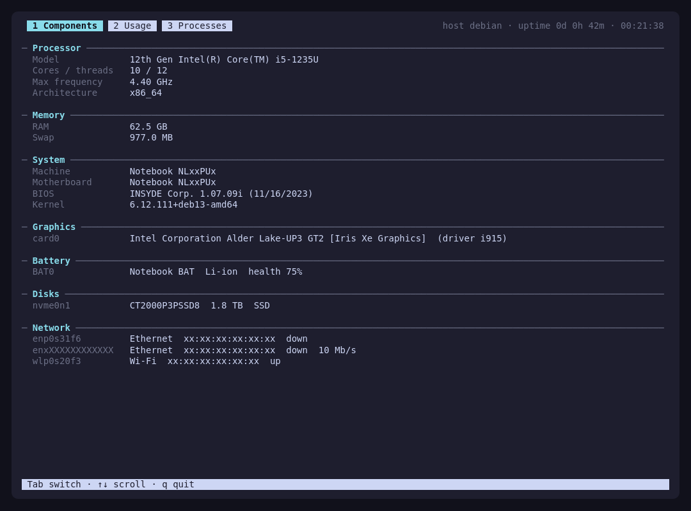
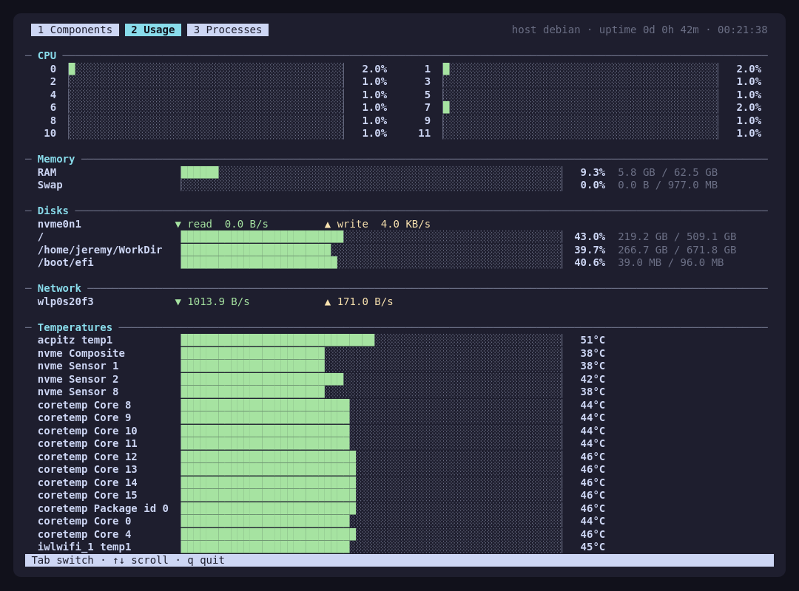
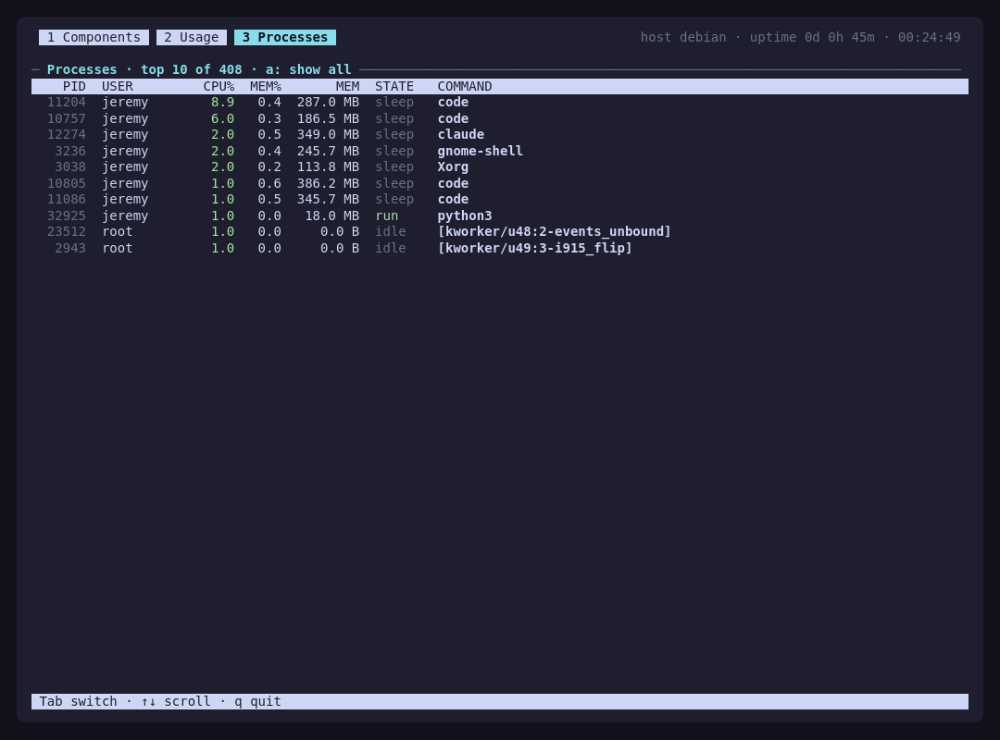

# jtop

Hardware components and live usage in your terminal, htop style.
Three tabs: **Components** (CPU, memory, motherboard, GPU, battery, disks, network), **Usage**
(per-core CPU, RAM/swap, disk and network throughput, filesystems, temperatures, battery)
and **Processes** (sorted by CPU, with memory, user and command).

Linux: Python 3 standard library, no dependencies, installs with apt. Windows 11: installs with [pipx](#install-windows-11).







## Install (Debian / Ubuntu)

```sh
sudo curl -fsSLo /usr/share/keyrings/jtop.gpg https://notdjz.github.io/jtop/jtop.gpg
echo "deb [signed-by=/usr/share/keyrings/jtop.gpg] https://notdjz.github.io/jtop ./" | sudo tee /etc/apt/sources.list.d/jtop.list
sudo apt update
sudo apt install jtop
```

Then run `jtop`. Updates come with `sudo apt upgrade`.

For fun: `jtop --fun`

## Install (Windows 11)

With a 64-bit Python 3, git and [pipx](https://pipx.pypa.io):

```powershell
pipx install git+https://github.com/NotDjz/jtop
```

Then run `jtop`. Updates come with `pipx upgrade jtop`.

For fun: `jtop --fun`

No temperatures, which Windows does not expose without a driver. Without administrator rights, system processes
show `?` as their user and their name instead of their command line.
